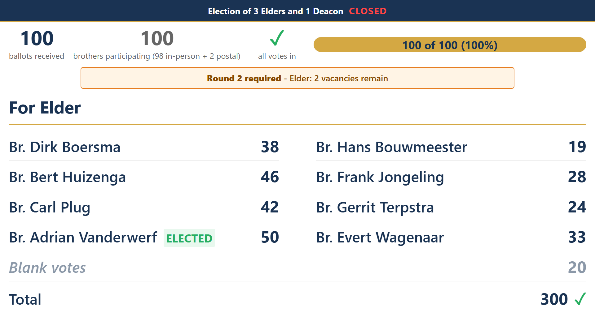
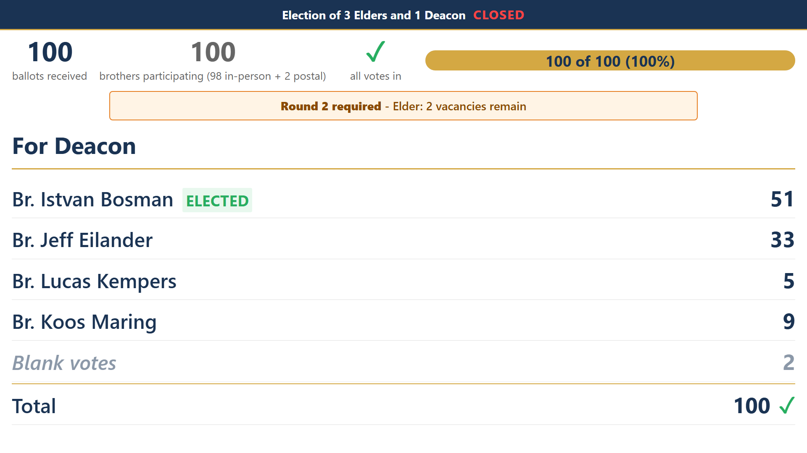
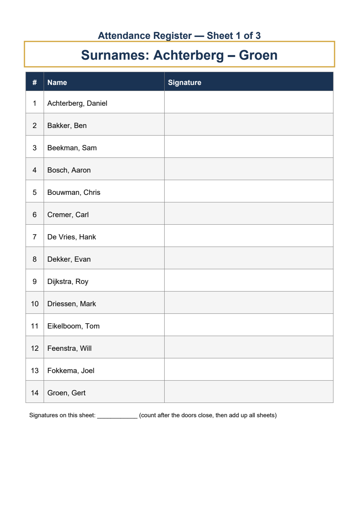
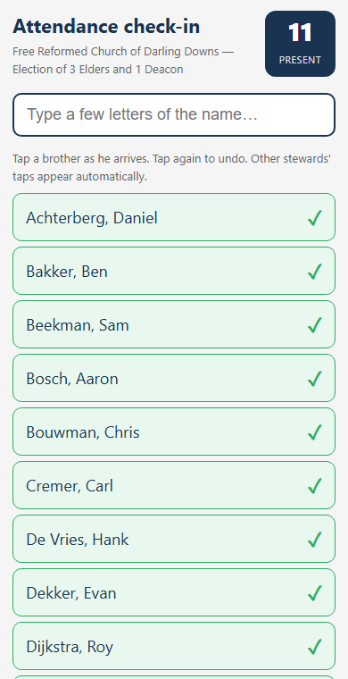
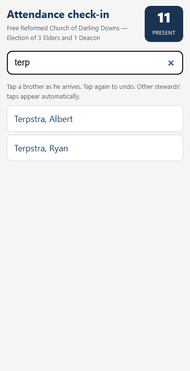
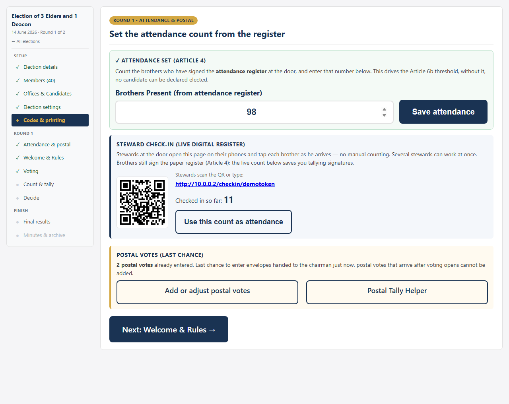

# Election App — Improvements After Our First Election

*Free Reformed Church of Darling Downs — June 2026*

We used the election app for the first time at the office bearer election on **7 June 2026**. It worked well. Two things stood out as needing improvement, both raised by members on the day:

1. **The text on the screen was too small** — brothers at the back of the church could not read the results.
2. **Signing the attendance register took too long** — everyone queued for one sheet of paper and one pen.

Both have now been addressed. This document explains what changed, in plain terms. *(All names in the screenshots are fictional.)*

---

## 1. The screen is now readable from the back

Three changes were made to what the congregation sees on the projector:

**The rule calculations are gone.** The screen used to show the Article 6a and 6b workings (the "valid votes ÷ vacancies ÷ 2" arithmetic) for every office. The chairman and secretary read those numbers from their own screen — the congregation does not need them. Removing them freed up a large amount of space.

**The "how votes arrived" bar is gone.** The bottom strip showing how many votes came in digitally, on paper, or by post served no purpose for the congregation and has been removed.

**One office at a time, much larger.** Instead of squeezing Elder and Deacon side by side, the screen now shows **one office at a time, using the full width**, and switches to the next office every few seconds (the timing is adjustable). A long candidate list — we can have up to eight Elder candidates — flows into two columns. The result: candidate names and vote counts are roughly **twice as large** as before, and the size adjusts itself so nothing ever falls off the bottom of the screen.

*The Elder results fill the whole screen. A few seconds later the display switches to the Deacon results:*

Everything else works as before: the live ballot counter, the "Round 2 required" notice when a runoff is needed, and the ELECTED markers once results are shown.

---

## 2. Sign-in at the door is now much faster

On 7 June, every brother queued for a single attendance register. Two changes fix this — one on paper, one digital. They work together, but each also works on its own.

### a) The paper register now prints as several one-page sheets

The attendance register no longer prints as one long list. It automatically splits into **single-page sheets of at most 16 names each**, in alphabetical order, with the surname range printed in large letters at the top of each sheet — so the sheet itself acts as the signpost on the table.

With our current membership that is **7 sheets**. Lay them out across two or three tables, each with its own pen, and brothers find their own sheet and sign — several at once instead of one at a time. One steward can comfortably mind two adjacent sheets.

The signature boxes are also much bigger than before (this was a genuine fault — the rows printed far smaller than intended), and each sheet has a tally line at the bottom so the signatures can be counted per sheet and added up quickly.

### b) Stewards can check brothers in on their phones (optional)

As a brother arrives and signs, a steward taps his name on a phone. The page is simple: type a few letters of the name, tap, done. A tap can be undone by tapping again. Several stewards can work at the same time — each phone sees the others' taps within a few seconds.

| At the door | Finding a name |
|---|---|
|  |  |

The benefit comes at the chairman's table: the app shows the **live count of brothers checked in**, and the attendance number — which Article 4 requires and which determines whether candidates reach the required majorities — **fills itself in**. Nobody has to count signatures under time pressure before voting can open.

Stewards get access by scanning a QR code shown on the chairman's screen — they do not need the admin password, and the address is the direct network address that works reliably on phones.

**Important:** the paper register is still signed exactly as Article 4 requires. The phone check-in only replaces the *counting* of the signatures, not the signatures themselves. And the feature is entirely optional — it can be switched off for any election, in which case the admin simply counts the signatures on the sheets (using the per-sheet tally lines) and types the number in, as before.

---

## What has *not* changed

- How brothers vote (phone with a one-time code, or paper ballot) — unchanged.
- Vote secrecy and the one-vote-per-member safeguards — unchanged.
- The counting, runoff rules (Articles 6a/6b), and results — unchanged. The rule calculations are still applied and still visible to the chairman; they have only been removed from the public screen.
- The printer pack — it simply now contains the new register sheets automatically.

---

*Prepared 10 June 2026. The improvements are installed and were verified with a test election on the church laptop.*
