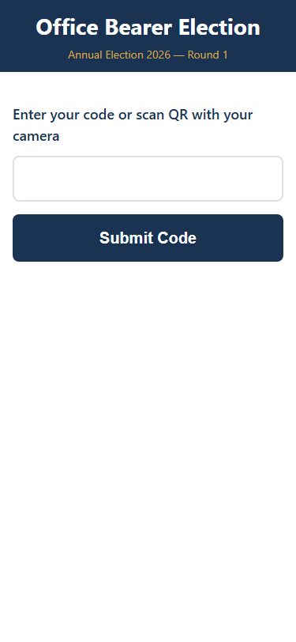
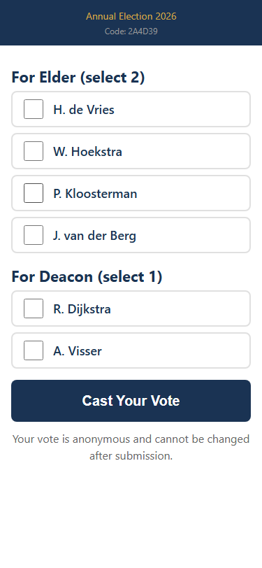
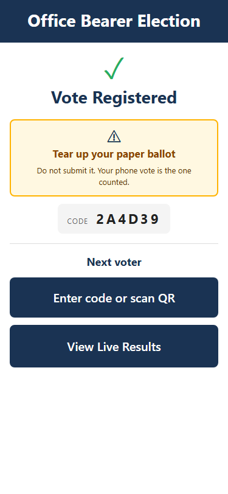
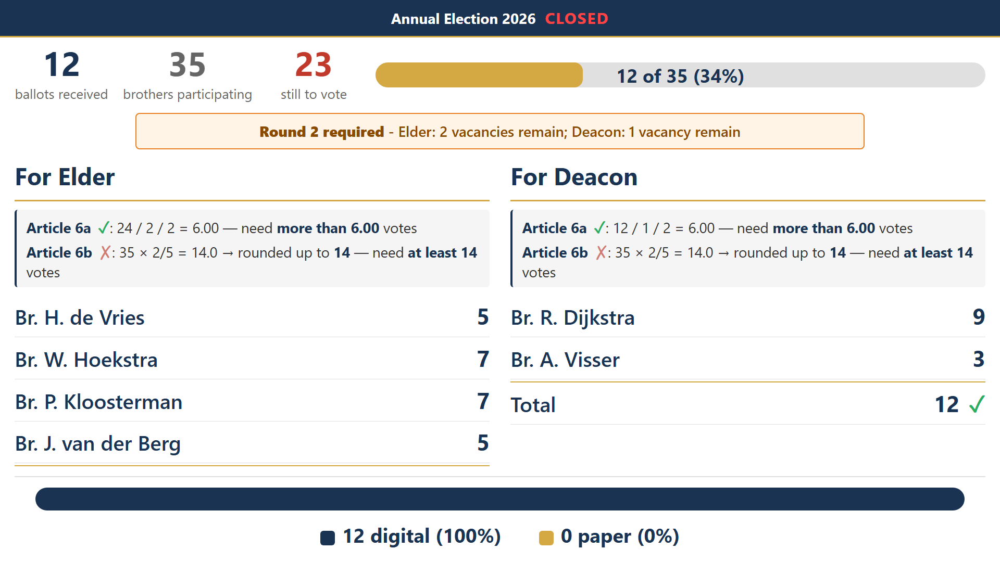

# Deacon Election — Guide for the Congregation

*A short guide for brothers on how the upcoming election of one deacon will run.*

---

## What will happen

The church council will run the election for one deacon according to the Rules for the Election of Office Bearers. The process is the same as a regular election, spread across several Sundays:

1. **Nominations (two Sundays).** Brothers are invited to submit signed nominations with reasons, for brothers they consider suitable for the office of deacon.
2. **Council meeting.** After the second nomination Sunday, the church council meets to draw up the final list of candidates. The list has twice the number of vacancies (so: two candidates for one vacancy), unless council decides otherwise under Article 13.
3. **Announcement.** The names of the candidates are read from the pulpit on the Sunday following the council meeting. Ward elders notify the candidates before this announcement.
4. **Election day.** On a later Sunday the congregation is called together for the election.

All male communicant members present on election day sign the attendance register before voting begins (Article 4).

---

## On election day — at the door

When you arrive:

1. **Sign the attendance register.** This count is needed to work out the threshold of votes required for a candidate to be elected (Articles 6 and 7).
2. **Pick up one voting card.** The task team hands out a dual-sided card at the door. One side is a paper ballot; the other side is a code slip for voting on your phone.
3. **Choose which side to use.** You can vote on paper or on your phone — whichever you prefer. See below.

> **Paper is always an option.** The paper ballot and the phone code are on the same card. If at any point the phone method doesn't work for you — for any reason — simply use the paper ballot side instead. Paper ballots are counted together with the digital votes. No one will know which method you used.

---

## Option A — Voting on your phone

### Step 1: Connect to the church WiFi

The WiFi network name is shown on the projector at the front of the hall. There is no internet on this network — it only reaches the voting app on the laptop in the hall.

### Step 2: Open the voting page and enter your code

Either scan the QR code on your card, or open the web address shown on the projector. You will see this screen:

Type the 6-character code from your card and tap **Continue**. Codes are case-insensitive.

### Step 3: Mark your ballot

The ballot shows the candidates for the office of deacon. Tick the candidate you wish to vote for.

You may leave it blank if you wish — a partial or blank ballot remains valid to the extent it clearly indicates a valid choice (Article 7).

### Step 4: Submit

Tap **Cast Your Vote**. You will see a confirmation screen:

Your code is now used and cannot be used again. The vote is recorded anonymously — there is no link in the database between your code and the vote it cast.

### Sharing a phone

If a brother doesn't have a phone, he can borrow one. After a vote is cast, the app returns to the code-entry screen so the next brother can enter his own code and vote on the same device.

---

## Option B — Voting on paper

If you prefer paper:

1. Use the **paper ballot** side of your card.
2. Mark your choice clearly with the pen provided.
3. Place the paper ballot in the ballot box as you leave.

Paper ballots are counted by at least two brothers after voting closes, and the totals are entered into the app so that paper and phone votes are combined for the final result. Paper ballots remain the fallback at all times — if the app or the WiFi has any trouble on the day, everyone switches to paper and the election continues uninterrupted.

---

## After voting closes

The chairman closes voting. Paper ballots are counted. Totals are displayed on the projector at the front:

The consistory with the deacons determines whether the threshold has been met per the election rules:

- **Article 6a** — more than half of the valid votes cast, divided by the number of vacancies.
- **Article 6b** — at least two-fifths of the number of brothers who participated in the election (fractions rounded upwards).

A candidate is elected only if both thresholds are met. If the vacancy is not filled in the first round, a second round is held between the remaining candidates (Article 7).

The names of any appointed brothers will be announced on the following Sunday so that the congregation may give its approbation (Article 9). Formal objections against the procedure must be lodged at the election meeting itself (Article 12).

---

## Summary

- Come to church; sign the register.
- Pick up your card at the door.
- Vote on your phone or on paper — your choice.
- Paper is always available as a fallback.
- Your vote is anonymous either way.

If you have any questions before the election, please speak to your ward elder or a member of the task team.
