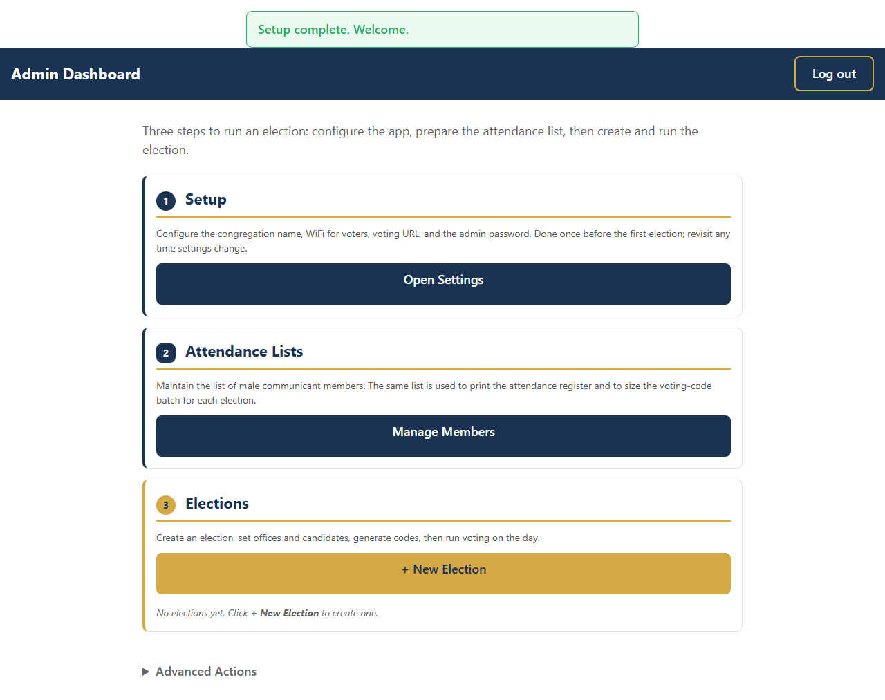
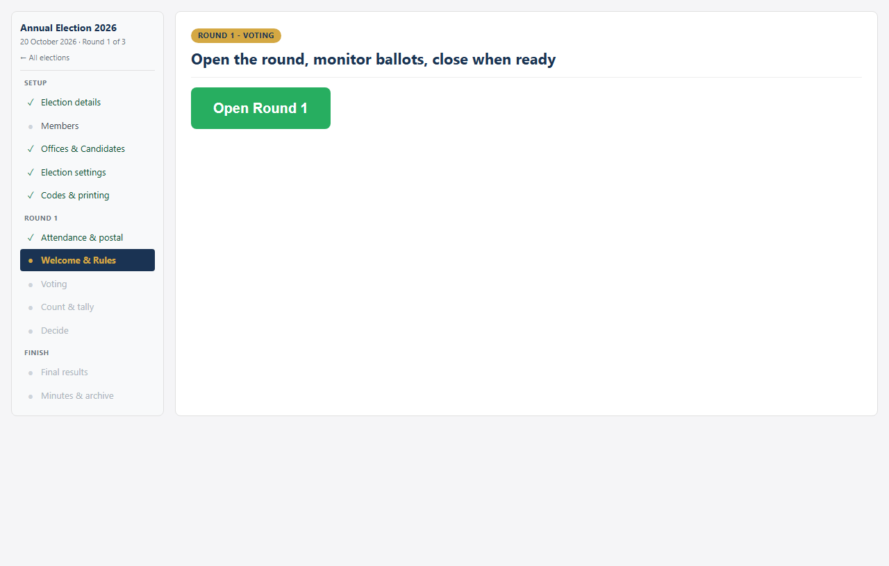
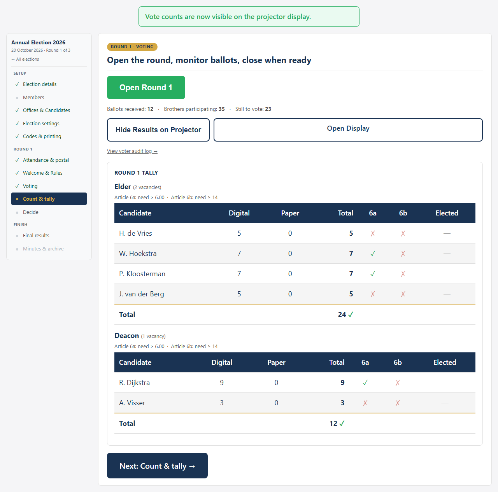

# FRCA Election App — User Guide for Consistory

*A step-by-step guide for running office-bearer elections using the Election App.*

---

## Overview

The FRCA Election App lets brothers vote on their phones over a local
WiFi network during congregational elections for elders and deacons. It
runs on a single laptop — no internet required.

**Key features:**
- Digital voting on phones via unique one-time codes (auto-generated)
- Paper ballots accepted alongside digital voting (chairman counts and
  enters totals afterwards)
- Postal vote support (Round 1 only)
- Live tally on a projector display, with Article 6a/6b threshold ticks
- Multi-round elections with chairman-driven candidate carry-forward
- Voter audit log of every code attempt (accepted, rejected, used twice)
- Election minutes DOCX, with full round-by-round narration
- Compliant with the FRCA Rules for the Election of Office Bearers

---

## Before Election Day

### 1. First-time setup

When you first open the admin panel a setup wizard guides you through:

- **Congregation name** — shown on every page and PDF
- **Short name** — used in PDF filenames
- **WiFi network name (SSID) and password** — printed on every code
  slip so voters know which network to join
- **Voting Base URL** — encoded in the QR code on every slip; for most
  congregations the default `http://church.vote` is right
- **Admin password** — change from the default; at least 6 characters

> **Tip:** The Settings page can be re-opened from the dashboard at any
> time. Existing values are pre-filled, and the password fields can be
> left blank to keep the existing password.

### 2. Maintain the member list

The dashboard reads top-to-bottom as a three-step flow. Step 2,
**Attendance Lists**, opens the member directory.

You can import a CSV (e.g. exported from Church Social) of male
communicant members. The same list is used to print the attendance
register and to size the voting-code batch for each election.

### 3. Create an election

Step 3 on the dashboard, **Elections**, has a **+ New Election** button.

- **Election name** — e.g. "Annual Election 2026"
- **Maximum rounds** — a hint only; no longer a hard cap (Article 7
  determines when the election concludes)
- **Election date** — for the minutes header

### 4. Add offices and candidates

Click **Offices & Candidates** on the new election to add each office
(Elder, Deacon) with:

- **Number of vacancies**
- **Candidates** — type each name; press Enter to commit it as a tag

**Article 2 compliance:** the app warns if the slate is not exactly
twice the number of vacancies. You can proceed under Article 13 with
explicit confirmation.

### 5. Voting codes are generated automatically

Click **Codes** in the election nav. The app auto-generates enough
codes for every member across the maximum number of rounds, plus
spares. No manual generation step is needed.

> **Important:** The codes shown immediately after generation are the
> only time the plaintext is visible. Print the slips before leaving
> the page.

The codes page guards against accidental regeneration after voting
starts: the **Delete All Codes** action requires typing the election
name and re-entering the admin password. If you re-print, the
already-printed slips become invalid — protect printed slips like
ballots.

### 6. Print the materials

On the **Manage** tab, **Step 1 — Before the meeting** has the
print-ahead pack:

- **Printer Pack ZIP** (recommended) — contains everything in one bundle
- **Attendance Register PDF**
- **Voting Codes** link (back to the codes page above)
- **More formats** disclosure for individual PDFs (counter sheet,
  dual-sided ballots, paper ballot, dual-ballot handout, code slips)

### 7. Enter postal votes (if any)

Still in Step 1, **Postal votes** has buttons to **Enter Postal Votes
(Round 1)** and a **Postal Tally Helper**. Postal votes count only in
Round 1. They are added to the Round 1 totals before thresholds are
calculated.

---

## Election Day

### 8. Sign the attendance register

As brothers arrive, have them sign the printed attendance register.
The total is needed for the Article 6b threshold (`participants × 2/5`).

### 9. Open the meeting

In the **Manage** tab, **Step 2 — Opening the meeting** is now the
active card. It contains:

- The projector display stepper (Welcome → Election Rules → Voting)
- An **Open Display** link to launch the projector view in a new tab
- An **Attendance** input — enter the **Brothers Present** count from
  the register and click Save. (The paper-ballot count is entered later
  in Step 4 once the ballots are physically collected.)

Walk the projector through the phases:

1. **Welcome** — congregation header (default on first load)
2. **Next: Election Rules →** — projector now shows the slate and
   Articles 4, 6, and 12 for the secretary to read aloud
3. **Next: Open Voting →** — opens voting and switches the projector to
   the live ballot view

### 10. Hand out codes (or paper ballots)

At the door, hand each brother either a code slip or a paper ballot.
Keep both stacks separate. Brothers who voted digitally must **not**
also hand in a paper ballot.

### 11. How brothers vote

A brother connects to the church WiFi, then opens the voting URL
printed on the slip (or scans the QR code).

**Step 1:** Enter the 6-character code (or arrive via QR).

**Step 2:** Tick candidates for each office, up to the allowed number.

**Step 3:** Tap **Cast Your Vote**. The code is burned immediately and
cannot be reused. The vote is recorded anonymously — no link from code
to vote exists in the database.

The confirmation page displays the burned code and a clear "Next
voter" button so a phone can be passed along without confusion.

> **Partial ballots:** under-voting is allowed but the app warns first.
> The brother must confirm before the partial ballot is cast.

### 12. Monitor progress

Step 3 of the Manage page becomes active while voting is open. It
shows:

- Big counters: ballots received, brothers participating, still to vote
- A live per-office tally with green ✓ or red ✗ marks against Articles
  6a and 6b for each candidate
- **Hide / Show Results on Projector** — by default the audience does
  not see live counts during voting
- A red **Ballot anomaly** banner if more ballots come in than there
  are participants (e.g. someone voted online and also handed in paper)

The projector display shows a progress bar and Article 6 thresholds.

### 13. Close voting

Click **Close Voting** in Step 3. Step 4 — **Counting & Decide** — now
becomes the active card.

---

## After Voting Closes

### 14. Enter the paper-ballot count

Have at least two brothers count the paper ballots together. In Step 4,
enter the **Paper Ballots Received** total and click Save. (Per-
candidate paper tallies are entered separately in the next step.)

### 15. Enter per-candidate paper votes

Click **Enter Paper Votes (per candidate)** in Step 4. Enter the count
for each candidate from the counter sheet and save.

### 16. Show results on the projector

Click **Show Results on Projector** to reveal the per-candidate totals
to the congregation.

For each candidate the projector now shows:

- Total votes (digital + paper + postal-this-round)
- Article 6a tick (more than `valid_votes ÷ vacancies ÷ 2`)
- Article 6b tick (at least `⌈participants × 2/5⌉`)
- A green **ELECTED** badge for candidates who meet both thresholds
  *and* are within the top-N by vote count (where N = office vacancies)

### 17. Decide what's next

Step 4's decision panel offers two choices:

- **Start Round N+1** — pick the carry-forward candidates with the
  checkboxes (already-elected ones are auto-disabled). Click **Start
  Round N+1**. The app reduces the office's remaining vacancies by the
  number elected this round.
- **Show Final Results** — if every vacancy has been filled (or the
  council decides to stop), this switches the projector and phone
  views to the **Final Results** page.

If you advance to a new round, return to Step 2 of the Manage page and
walk the projector through Welcome → Rules → Voting again. The same
code batch is reused — no re-printing needed.

### 18. Final results

Step 5 — **Final results** — is active when every vacancy is filled,
or when you press **Show Final Results** explicitly. It contains:

- Elected brothers per office (alphabetical by surname)
- A **Show Final Results on Projector** button
- A **Download Election Minutes (DOCX)** button — round-by-round
  narrative ready for the secretary to fill in (placeholders for
  chairman name, scripture reference, etc.)

The projector and `/displayphone` views automatically switch to a
clean Final Results screen showing the elected brothers.

---

## Diagnostics: Voter Audit Log

The Manage page footer has a **Diagnostics** strip with a link to the
**Voter audit log**. This shows every voter-route hit with a
colour-coded result pill (accepted, rejected_invalid, rejected_used,
vote_submitted, etc.), along with the timestamp, IP, user-agent, and
the plaintext code.

A red banner at the top of the log calls out any code that produced
more than one acceptance — useful if a code somehow gets used twice.

---

## Troubleshooting Quick Reference

| Problem | Solution |
|---------|----------|
| Brother's phone won't load the page | Check WiFi; try a different browser; use the QR scan |
| "Invalid code" error | Verify the 6 characters (case-insensitive). If still failing, hand over a paper ballot |
| Code shows as "already used" but the brother insists they haven't voted | Check the **Voter audit log** for that code — usually two scans of the same QR slip |
| Anomaly banner shows on the projector | Investigate the cause (attendance miscount, double-voting). The chairman decides how to record the discrepancy in the minutes |
| WiFi drops out | Restart the WiFi router; cast votes are already saved |
| App crashes | Restart the app; all data is preserved in the database |
| Major failure | **Switch to paper ballots immediately** |

> **Standing rule:** If in doubt, fall back to paper ballots. The app
> is a convenience tool — paper voting is always the backup.

---

## Key Principles

1. **Anonymity is guaranteed** — there is no link between a voting
   code and a vote in the database
2. **Paper is always the fallback** — digital and paper votes are
   counted together
3. **All data stays local** — nothing leaves the church WiFi network
4. **The database is auditable** — the consistory can inspect it
   directly, and the Voter Audit Log shows every interaction
5. **Compliance built in** — Articles 2, 6, 7, and 11 are enforced by
   the app
