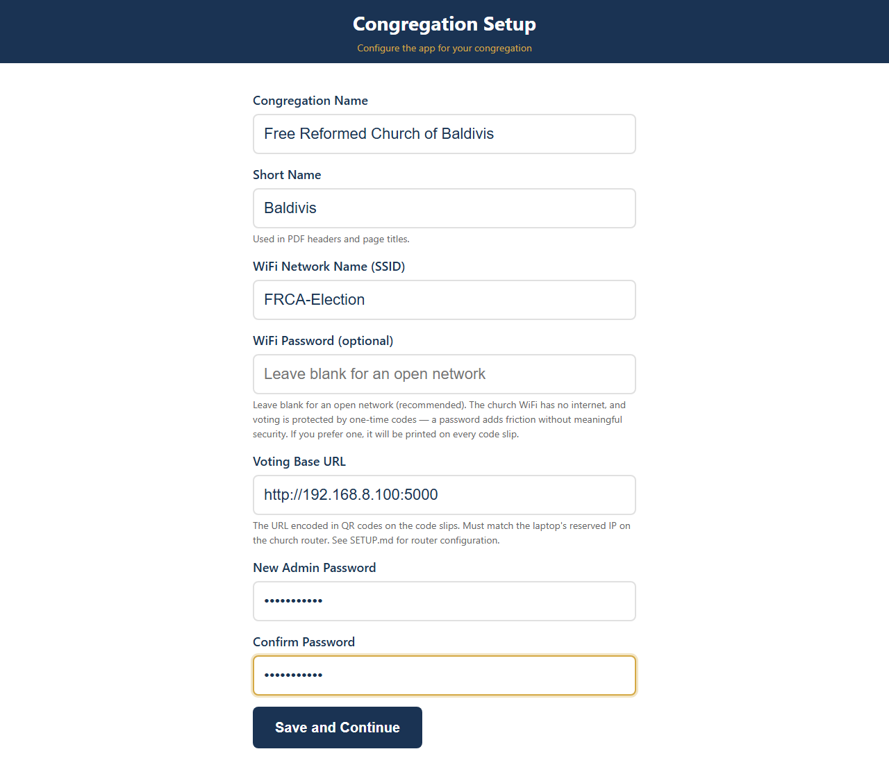
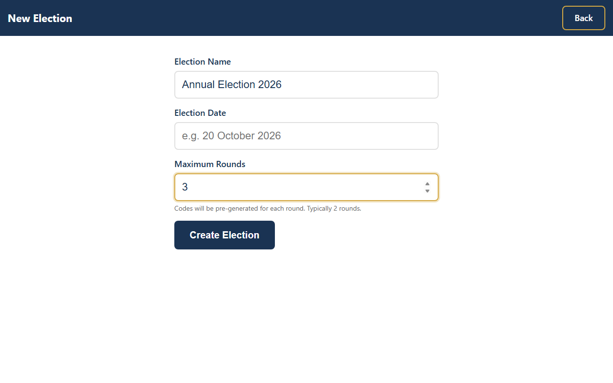
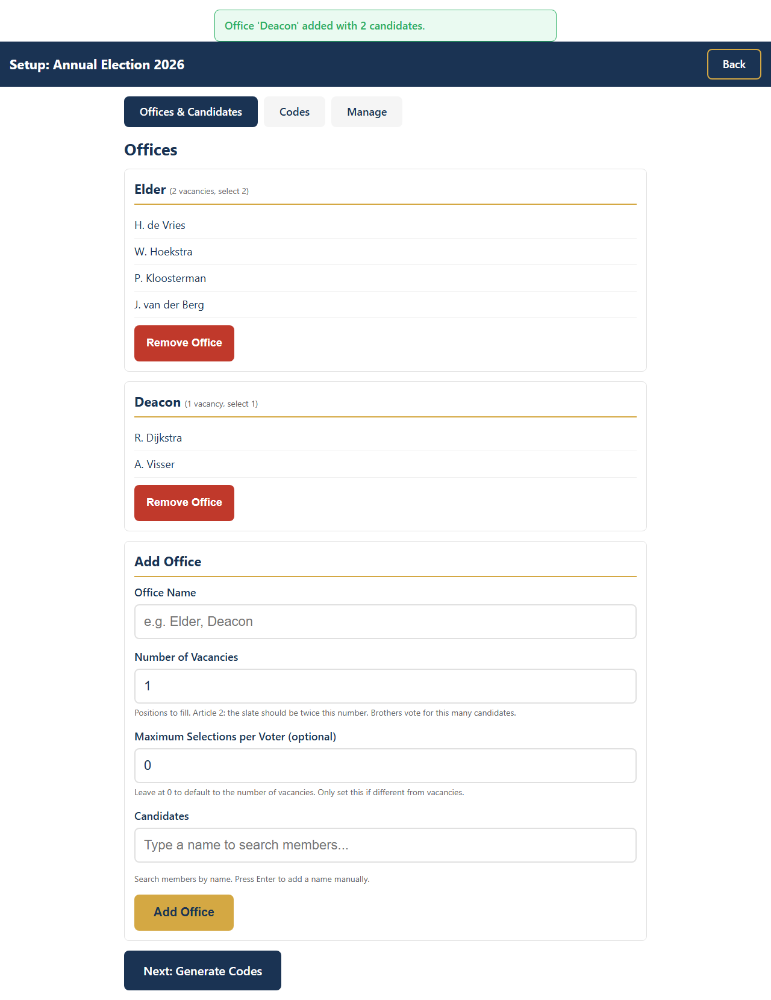
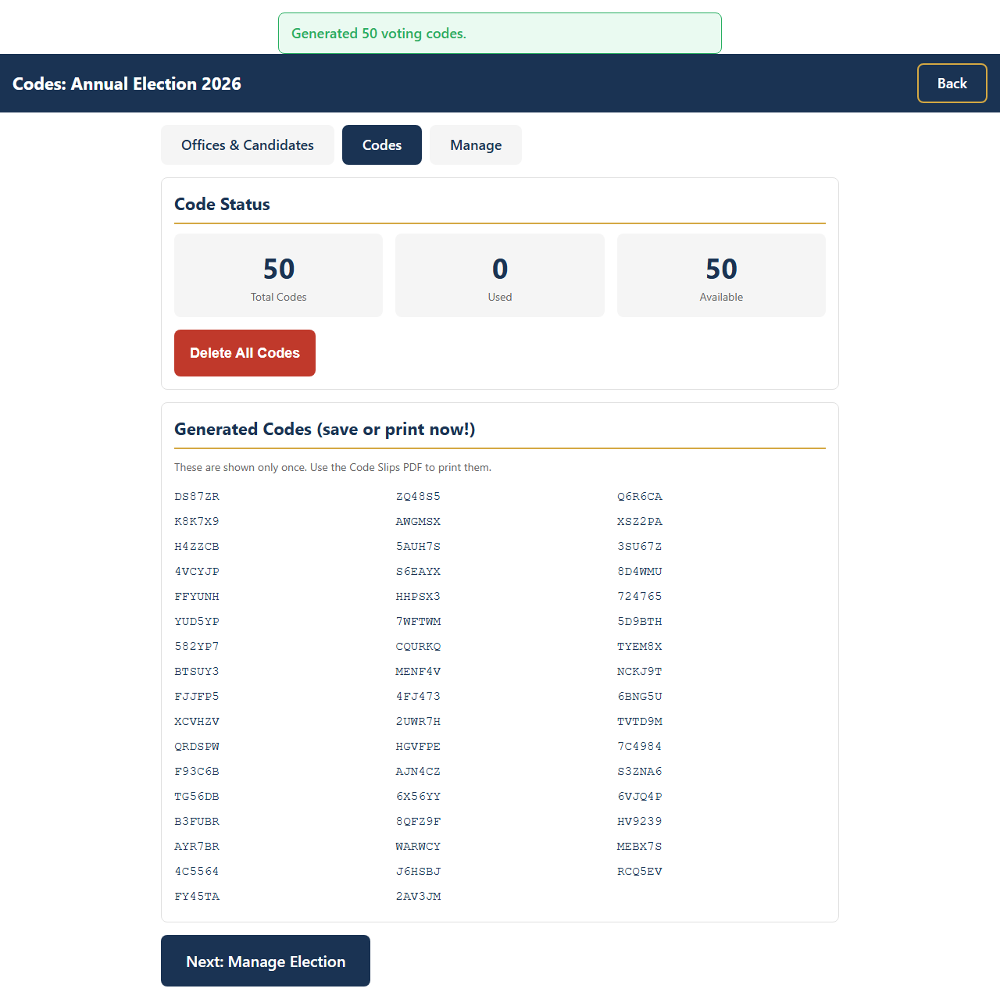
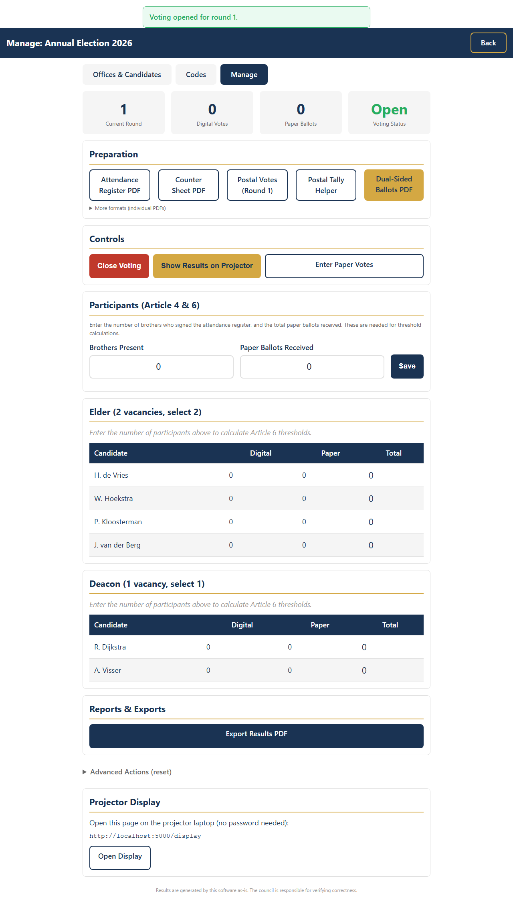
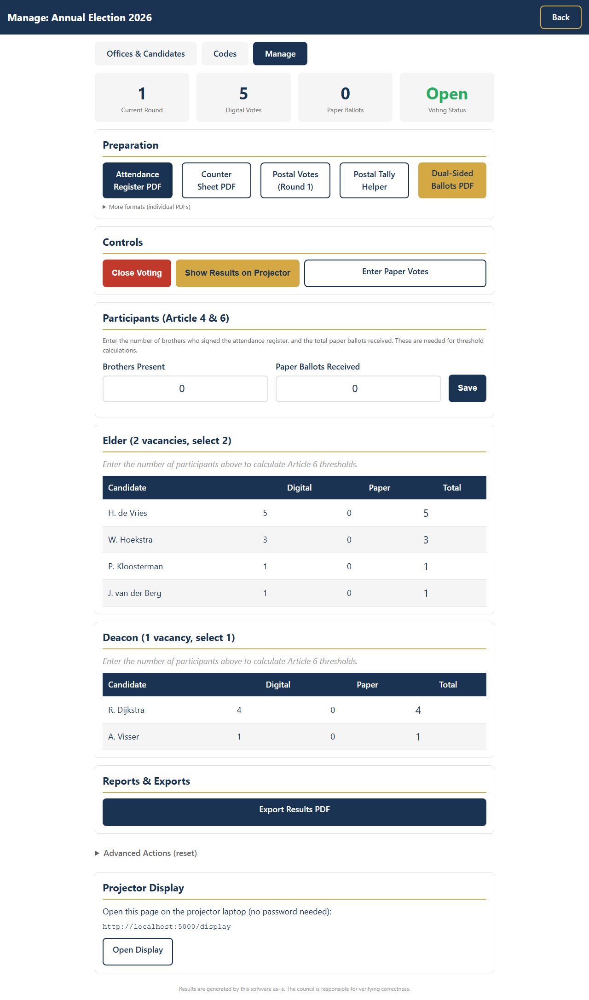
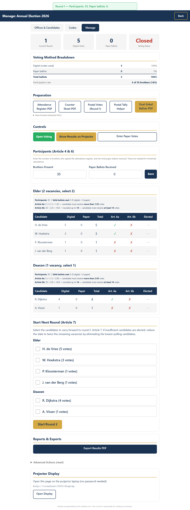

# FRCA Election App — User Guide for Consistory

*A step-by-step guide for running office bearer elections using the Election App.*

---

## Overview

The FRCA Election App enables brothers to vote on their phones over a local WiFi network during congregational elections for elders and deacons. It runs on a single laptop — no internet required.

**Key features:**
- Digital voting on phones via unique one-time codes
- Paper ballot support alongside digital voting
- Postal vote support (Round 1 only)
- Live results displayed on a projector
- Article 6 threshold calculations (automatic)
- Multi-round elections with candidate carry-forward
- Full compliance with FRCA Rules for Election of Office Bearers

---

## Before Election Day

### 1. First-Time Setup

When you first open the admin panel, a setup wizard will guide you through:

- **Congregation name** — displayed on all screens and PDFs
- **Short name** — used in PDF filenames
- **WiFi network name** — shown to voters so they know which network to connect to
- **Admin password** — change from the default; at least 6 characters

> **Tip:** The technical brother should have already configured the laptop and WiFi router per the SETUP guide before this step.

### 2. Import Members (Optional)

From the **Members** tab on the dashboard, you can import a CSV file (e.g., from Church Social) containing your member list. This enables:

- Auto-complete when adding candidates
- Attendance register PDF generation

### 3. Create an Election

Click **"+ New Election"** on the dashboard.

- **Election name** — e.g., "Annual Election 2026"
- **Maximum rounds** — typically 2 or 3 (in case not all positions are filled in Round 1)
- **Election date** — for record-keeping

### 4. Add Offices and Candidates

On the election setup screen, add each office (Elder, Deacon) with:

- **Number of vacancies** — positions to fill
- **Candidates** — type names one by one (they appear as tags)

**Article 2 compliance:** The app enforces that the slate size equals twice the number of vacancies. If you need a different slate size, you can proceed under Article 13 (deviation from rules) with confirmation.

### 5. Generate Voting Codes

Navigate to the **Codes** tab and generate enough codes for all brothers.

**How many codes?** Generate enough for all eligible brothers plus some spares. Each brother needs one code per round.

After generating codes, go to the **Manage** tab where you can download PDFs under the **"More formats"** section:
- **Code Slips PDF** — pre-printed slips with QR codes for handing out at the door
- **Paper Ballot PDF** — for brothers who prefer paper

> **Important:** Code slips should be printed and cut before election day. The QR codes link directly to the voting page.

---

## Election Day

### 6. Sign the Attendance Register

As brothers arrive, have them sign the attendance register (printable from the Members tab). This count is needed for Article 6 threshold calculations.

### 7. Hand Out Codes

At the door, hand each brother a code slip (one per person). Keep a record of how many slips you hand out. Brothers who prefer paper receive a paper ballot instead.

### 8. Open Voting

In the **Manage** tab, click **"Open Voting"**.

The projector display will show **"OPEN"** with the WiFi network name and voting URL.

### 9. How Brothers Vote

Brothers connect their phone to the church WiFi and:

**Step 1:** Open the voting page and enter their 6-character code.

**Step 2:** Select candidates for each office (checkboxes).

The ballot shows each office with its candidates. Brothers select up to the allowed number of candidates per office.

**Step 3:** Tap **"Cast Your Vote"** to submit.

The code is immediately burned — it cannot be used again. The vote is recorded anonymously.

> **Shared phones:** After submitting, the screen returns to the code entry page so another brother can vote on the same phone.

> **Partial ballots:** If a brother selects fewer candidates than allowed, the app will show a warning but allow them to proceed (Article 7 compliance).

### 10. Monitor Progress

The **Manage** tab shows real-time vote counts.

The **projector display** shows a progress bar with the number of ballots received.

### 11. Close Voting

When all brothers have voted (or the chairman calls time), click **"Close Voting"** in the Manage tab.

---

## After Voting Closes

### 12. Count Paper Ballots

Have at least two brothers count the paper ballots together. Enter the totals per candidate in the **Paper Votes** section of the Manage tab.

### 13. Enter Postal Votes (if any)

If postal votes were received, enter the totals in the **Postal Votes** section (Round 1 only).

### 14. Set Participants and Paper Ballot Count

In the **Participants** section of the Manage tab, enter:
- **Brothers Present** — the total from the attendance register
- **Paper Ballots Received** — the number of paper ballots collected

Both values are needed for Article 6 threshold calculations.

### 15. Review Results

The Manage tab automatically calculates and displays:

For each candidate:
- Digital votes, paper votes, postal votes (if applicable), and total
- **Article 6a threshold:** candidate must receive more than (total valid votes ÷ vacancies ÷ 2)
- **Article 6b threshold:** candidate must receive at least 2/5 of participants
- **Elected status:** a candidate is elected only if both thresholds are met

A green **ELECTED** badge appears next to candidates who meet both thresholds.

### 16. Show Results to Congregation

Click **"Show Results on Projector"** to display results on the projector screen.

### 17. Export Results

Click **"Export Results PDF"** in the Manage tab to download a PDF with the full results — vote totals per candidate (digital and paper), threshold calculations, and elected status.

---

## If a Second Round is Needed

If not all vacancies were filled in Round 1:

1. Select which candidates to carry forward to the next round
2. Click **"Start Round N"** (where N is the next round number)
3. Generate new codes for the new round
4. Print and hand out new code slips
5. Repeat the voting process

The app automatically handles candidate elimination and threshold recalculation.

---

## Troubleshooting Quick Reference

| Problem | Solution |
|---------|----------|
| Brother's phone won't load the page | Check WiFi connection; try a different browser |
| "Invalid code" error | Verify the code is entered correctly (6 characters, case-insensitive) |
| "Too many attempts" | Wait 60 seconds, then try again |
| WiFi drops out | Restart the WiFi router; votes already cast are safe |
| App crashes | Restart the app; all data is preserved in the database |
| Major failure | **Switch to paper ballots immediately** |

> **Standing rule:** If in doubt, fall back to paper ballots. The app is a convenience tool — paper voting is always the backup.

---

## Key Principles

1. **Anonymity is guaranteed** — there is no link between a voting code and a vote in the database
2. **Paper is always the fallback** — digital and paper votes are counted together
3. **All data stays local** — nothing leaves the church WiFi network
4. **The database is auditable** — the consistory can inspect it at any time
5. **Compliance built in** — Article 2, 6, 7, and 11 rules are enforced by the app
